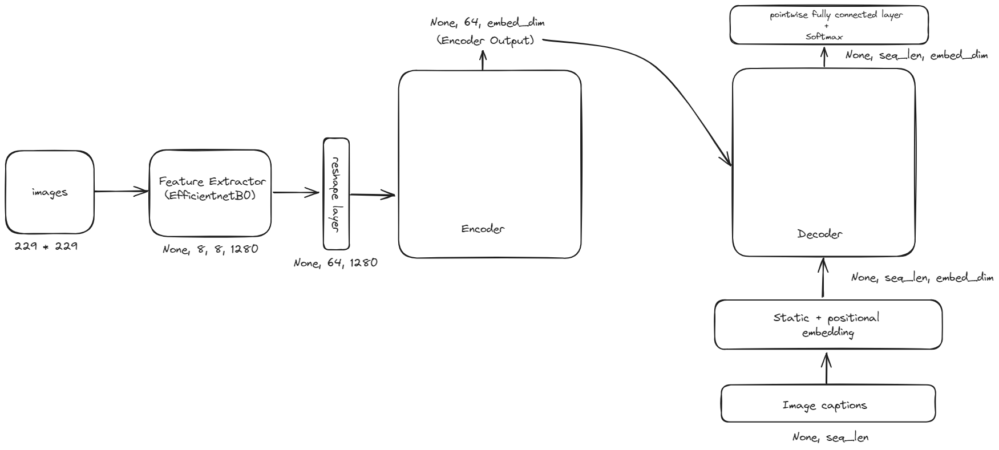
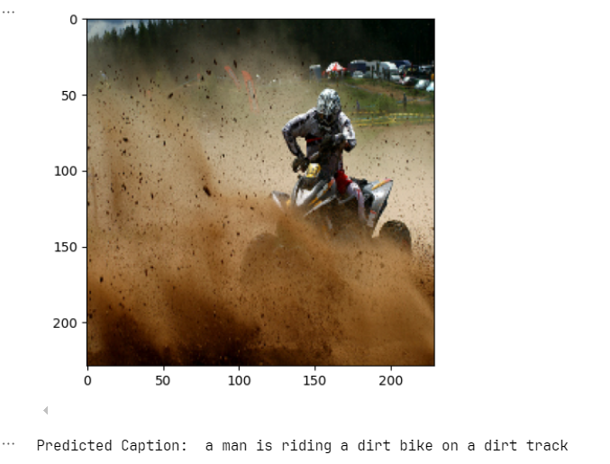
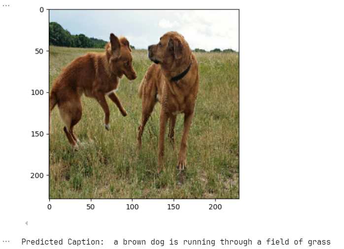
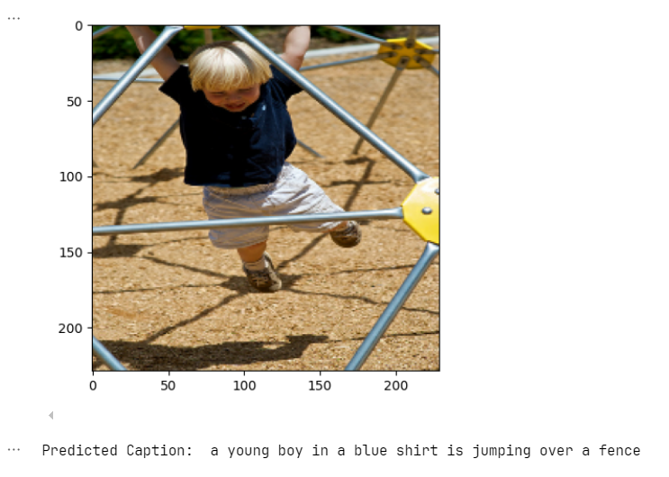

# Image Caption Generation with Transformers

## Model Overview

It's a simple transformer model with only one encoder and decoder block

## Dataset

The dataset used to train the model is Flickr8k Dataset
**Download links:**

- images: <https://github.com/jbrownlee/Datasets/releases/download/Flickr8k/Flickr8k_Dataset.zip>
- captions: <https://github.com/jbrownlee/Datasets/releases/download/Flickr8k/Flickr8k_text.zip>

## Model Outputs

## Further improvements

1. Fine-tune the feature extractor cnn model
2. Stack multiple decoder blocks
3. Use Subword tokenization
4. Train on large datasets
